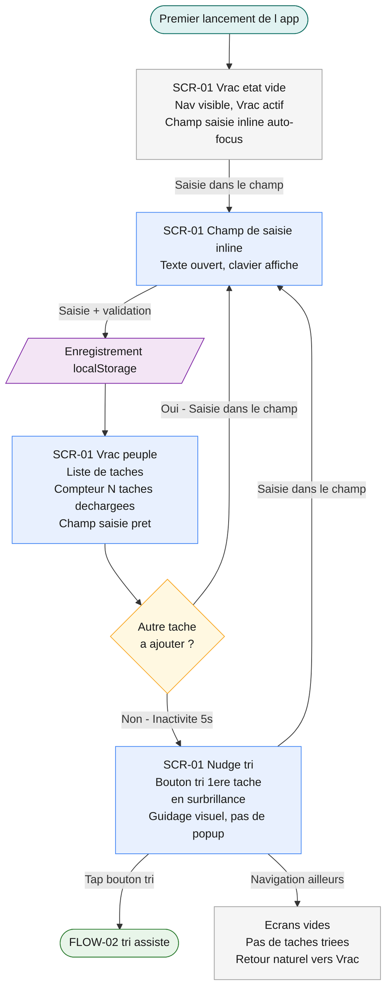
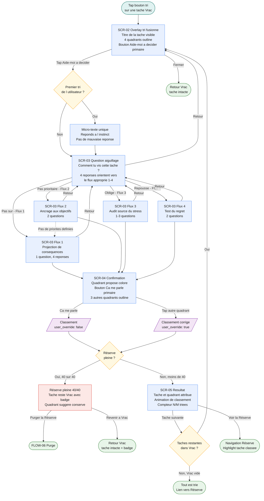
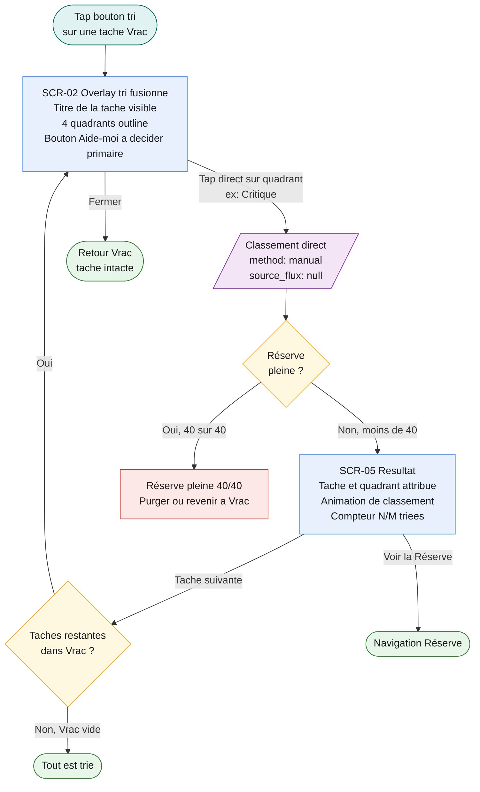
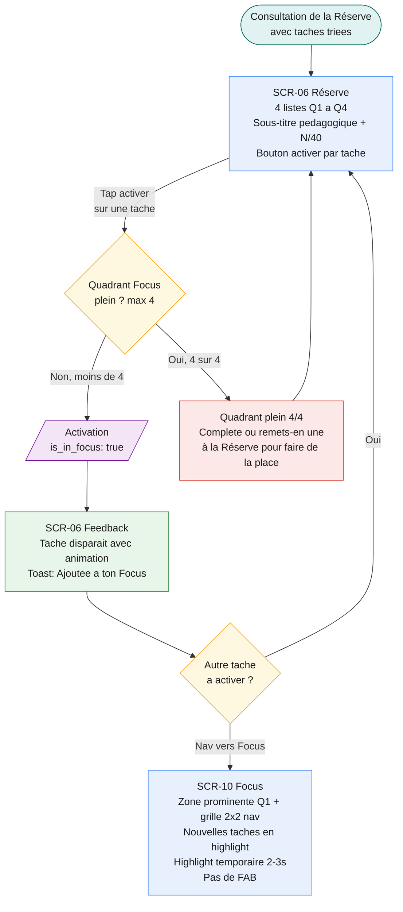
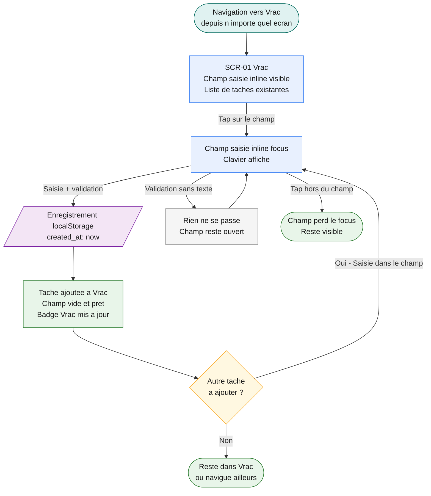
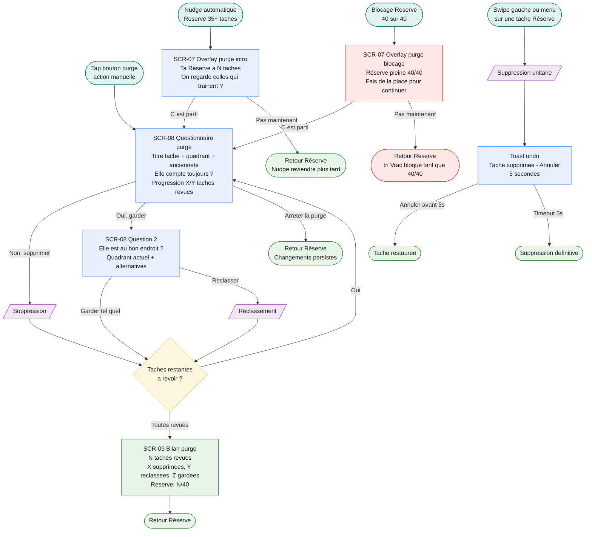
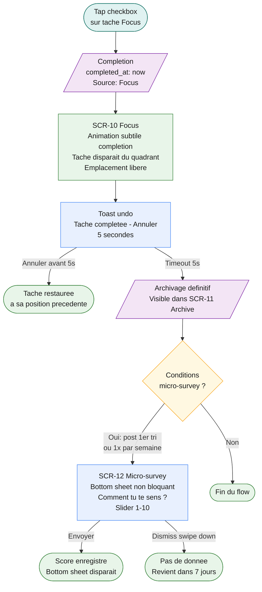
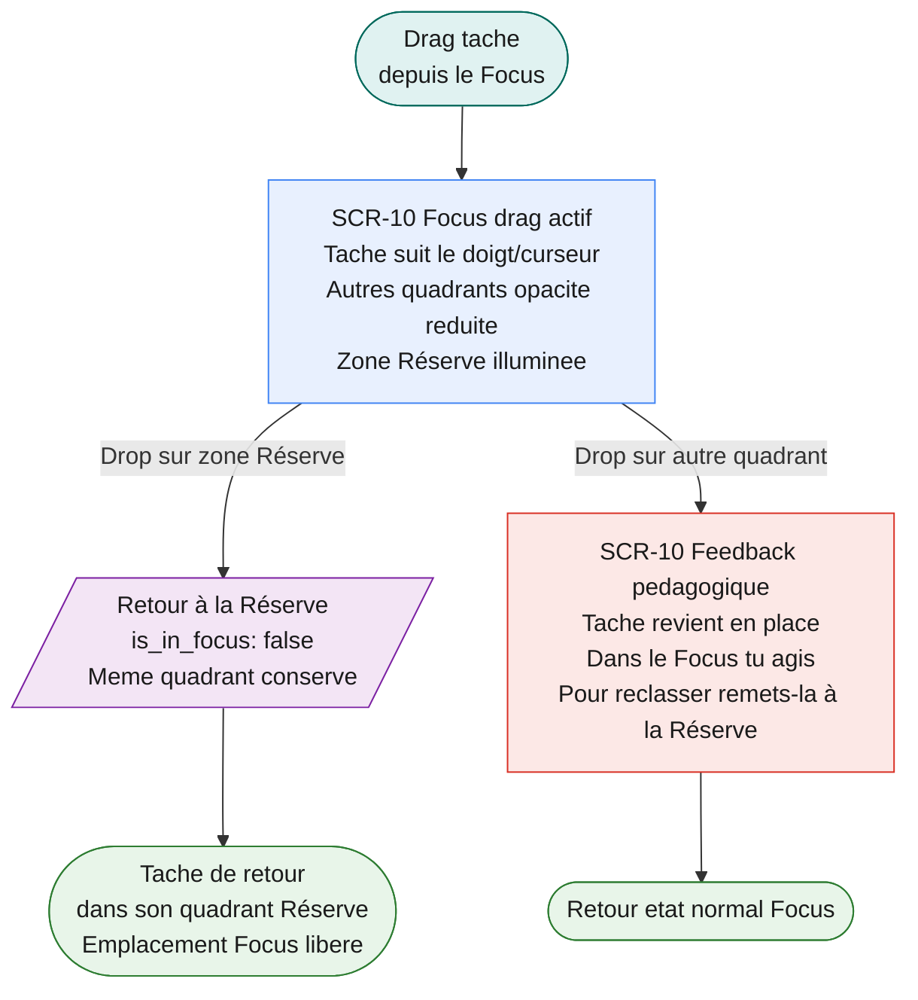

# Architecture de l'information & Flows utilisateur — izh

> **Usage agent :** Produit après les personas. Définit QUELS écrans existent et DANS QUEL ORDRE l'utilisateur les traverse. L'UI designer ne dessine que ce qui est défini ici. Chaque flow doit couvrir tous les états : nominal, erreur, vide, chargement, succès, edge cases.

**Version :** v0.1
**Date :** 2026-03-03
**Auteur :** UX Designer (assisté par IA)
**Statut :** En cours — architecture validée, flows à produire
**Basé sur :** 01-brief-projet.md (v1.0), 02-personas-cas-usage.md (v0.1)

---

## 1. Architecture de l'information

### Principes d'organisation retenus

**Stratégie d'organisation :** Par tâche (workflow)

**Justification :**
Le produit est un pipeline linéaire — les tâches avancent dans un sens : non triées → classées → actionnables → complétées. Chaque écran correspond à un état de la tâche et à un état mental distinct de l'utilisateur :

| Écran   | État de la tâche     | État mental de l'utilisateur |
| ------- | -------------------- | ---------------------------- |
| Vrac    | Non triée            | "Je décharge"                |
| Réserve | Classée par quadrant | "J'organise"                 |
| Focus   | Activée pour action  | "J'agis"                     |
| Archive | Complétée            | "J'ai accompli"              |

L'organisation par tâche (vs par contenu) a été choisie parce que :

1. Camille (north star) pense en workflow — "j'ai 45 min, faut que ça serve". Elle a besoin de savoir où elle en est dans le processus, pas de naviguer un catalogue.
2. Le workflow est le produit. izh n'est pas un espace de contenu à explorer — c'est un tunnel de transformation (chaos → clarté).
3. Les verbatims des personas confirment le modèle mental séquentiel : "vider ma tête" → "savoir quoi faire" → "avancer".

**Alternative écartée :** Vue unique avec tabs (Vrac/Réserve/Focus dans le même écran). Trop dense, viole le principe #3 du brief ("moins tu vois, mieux tu agis").

**Règle de profondeur :** Maximum 2 niveaux de navigation
**Justification :** Web app mobile-first avec 4 écrans de niveau 1. Les flows de tri et de purge sont des overlays (niveau 2), pas des écrans supplémentaires — l'utilisateur ne quitte jamais le contexte de son écran. Pas de risque de désorientation (Nogier : au-delà de 3-4 niveaux, désorientation).

---

### Arborescence du produit

```
izh
├── 📥 Vrac                                    (nav item 1)
│   ├── Liste de tâches non triées
│   ├── Édition inline du titre
│   ├── Sous-titre : "Note tes tâches en vrac, on les triera après · [N] à trier"
│   └── [Action] Trier → overlay de tri
│       ├── Classement manuel direct (tap sur un quadrant)
│       └── tri assisté → Questionnaire cognitif (Flux 1-4) → Confirmation
│
├── 📋 Réserve                                   (nav item 2)
│   ├── Sous-titre : "Tes tâches triées attendent ici, active celles que tu veux faire · [N]/40"
│   ├── [Bouton] "Faire du tri" (permanent, pleine largeur, au-dessus de la liste)
│   │   └── Lance la purge assistée → overlay de purge (SCR-07)
│   ├── Vue par quadrant (accordion, même layout mobile/desktop)
│   │   ├── Q1 — Critique           (rouge)
│   │   ├── Q2 — Essentiel          (jaune)
│   │   ├── Q3 — Fausse urgence     (bleu)
│   │   └── Q4 — Optionnel          (gris)
│   ├── Drag & drop libre entre quadrants
│   ├── Tri intra-quadrant (date de création / ordre manuel)
│   ├── Purge unitaire (swipe to delete + menu contextuel)
│   └── [Action] Activer une tâche → Focus
│       (pas de complétion dans la Réserve — uniquement dans le Focus)
│
├── 🎯 Focus                                   (nav item 3)
│   ├── Sous-titre : "Tes tâches du moment, max 4 par priorité · [N] en cours"
│   ├── Vue grille 2×2 (max 4 tâches par quadrant, labels actionnels + sous-titres)
│   │   ├── Q1 — Faire maintenant   "Urgent et important — en premier"
│   │   ├── Q2 — Protéger           "Important — fais-lui de la place"
│   │   ├── Q3 — Expédier           "Ça presse mais c'est pas vital — fais vite"
│   │   └── Q4 — Lâcher prise       "C'est ok si ça attend"
│   ├── [Action] Compléter (✓) → Archive
│   └── [Action] Remettre à la Réserve (même quadrant)
│       └── Feedback pédagogique si tentative de drag inter-quadrants
│
└── 📦 Archive                                   (nav item 4)
    ├── Sous-titre : "Tout ce que tu as accompli · [N] terminées"
    └── Liste des tâches complétées
```

**Éléments flottants / transversaux :**

- **Champ de saisie inline** : capture de tâche, visible en permanence dans Vrac uniquement. Pas de FAB — chaque écran a un rôle unique. Cf. `knowledge/Décisions UX — Suppression du FAB capture inline inbox.md`.
- **Overlays** : flow de tri (depuis Vrac), flow de purge (depuis Réserve), micro-survey de légèreté mentale (bottom sheet, post-action)

---

### Réponse aux 3 questions fondamentales de navigation (Nogier)

#### Vrac

| Question              | Solution retenue                                                                                                                                                                                 |
| --------------------- | ------------------------------------------------------------------------------------------------------------------------------------------------------------------------------------------------ |
| Où suis-je ?          | Item "Vrac" actif dans la bottom nav (highlight + label). Sous-titre : "Note tes tâches en vrac, on les triera après · 12 à trier". L'écran est reconnaissable : une liste brute sans quadrants. |
| Où étais-je ?         | Pas pertinent — c'est le point d'entrée naturel du workflow. Si l'utilisateur vient de la Réserve/Focus : la nav suffit, pas de breadcrumb nécessaire (profondeur 1).                            |
| Qu'y a-t-il d'autre ? | Bottom nav visible : Réserve, Focus, Archive. Champ de saisie inline toujours visible : "tu peux toujours ajouter". Sur chaque tâche : bouton de tri → "la suite est ici".                       |

**États de l'écran :**

| État                   | Déclencheur                        | UI                                                                                                                     |
| ---------------------- | ---------------------------------- | ---------------------------------------------------------------------------------------------------------------------- |
| Vide (première visite) | Ouverture initiale, aucune tâche   | Champ de saisie inline auto-focusé + message invitant (onboarding étape 1)                                             |
| Vide (Vrac triée)      | Toutes les tâches ont été classées | Message positif + lien vers Réserve                                                                                    |
| Peuplé                 | Tâches non triées présentes        | Liste de tâches avec bouton tri sur chacune. Sous-titre : "Note tes tâches en vrac, on les triera après · [N] à trier" |
| En cours de tri        | Overlay de tri actif               | L'overlay se superpose, Vrac reste visible dessous                                                                     |

#### Réserve

| Question              | Solution retenue                                                                                                                                                                                                         |
| --------------------- | ------------------------------------------------------------------------------------------------------------------------------------------------------------------------------------------------------------------------ |
| Où suis-je ?          | Item "Réserve" actif dans la bottom nav. Visuel immédiat : 4 listes colorées = 4 quadrants (structure unique, pas confondable). Sous-titre : "Tes tâches triées attendent ici, active celles que tu veux faire · 23/40". |
| Où étais-je ?         | Si arrivée depuis le tri : la tâche fraîchement classée apparaît avec un highlight temporaire dans son quadrant → feedback "tu viens de classer ça ici". Nav persistante = retour en un tap vers Vrac ou Focus.          |
| Qu'y a-t-il d'autre ? | Bottom nav : Vrac (badge si tâches non triées), Focus, Archive. Sur chaque tâche : bouton activer (→ Focus). Pour capturer une tâche : naviguer vers Vrac (1 tap).                                                       |

**États de l'écran :**

| État          | Déclencheur                  | UI                                                                                                                             |
| ------------- | ---------------------------- | ------------------------------------------------------------------------------------------------------------------------------ |
| Vide          | Aucune tâche classée         | "Trie tes premières tâches depuis Vrac" + lien vers Vrac                                                                       |
| Peuplé        | Tâches classées par quadrant | 4 listes avec compteurs par quadrant. Sous-titre : "Tes tâches triées attendent ici, active celles que tu veux faire · [N]/40" |
| Proche limite | 35+ tâches                   | Nudge doux ("37/40 — un petit tri ?")                                                                                          |
| Plein         | 40/40 tâches                 | Blocage côté Réserve uniquement + flow de purge proposé. Le Vrac reste illimitée.                                              |

**Affichage mobile (portrait) — Liste scrollable verticale :**
Les 4 quadrants s'empilent verticalement (Q1 en haut → Q4 en bas). Choisi plutôt que la grille 2×2 car : la Réserve peut contenir 40 tâches — la grille serait trop dense. La liste priorise la lisibilité et le drag & drop vertical. Q4 "Optionnel" est en bas, cohérent avec son rôle secondaire. La grille 2×2 est réservée au Focus (max 16 tâches).

**Desktop/tablette :** Même layout accordion que mobile — cohérence cross-device, pas de re-apprentissage. La Réserve peut contenir 40 tâches, les colonnes seraient trop denses et le drag inter-colonne moins intuitif que l'accordion.

#### Focus

| Question              | Solution retenue                                                                                                                                                                                 |
| --------------------- | ------------------------------------------------------------------------------------------------------------------------------------------------------------------------------------------------ |
| Où suis-je ?          | Item "Focus" actif dans la bottom nav. Sous-titre : "Tes tâches du moment, max 4 par priorité · 8 en cours". La vue grille 2×2 est unique dans l'app — pas confondable. C'est l'espace d'action. |
| Où étais-je ?         | Si arrivée depuis la Réserve (activation d'une tâche) : highlight temporaire de la tâche activée. Nav persistante pour retour à la Réserve/Vrac.                                                 |
| Qu'y a-t-il d'autre ? | Bottom nav : Vrac (badge si tâches non triées), Réserve, Archive. Sur chaque tâche : checkbox (compléter) + geste remettre à la Réserve. Pour capturer : naviguer vers Vrac (1 tap).             |

**États de l'écran :**

| État                              | Déclencheur                             | UI                                                                                                                                                                                                                         |
| --------------------------------- | --------------------------------------- | -------------------------------------------------------------------------------------------------------------------------------------------------------------------------------------------------------------------------- |
| Vide                              | Aucune tâche activée                    | "Active des tâches depuis ta Réserve" + lien vers Réserve                                                                                                                                                                  |
| Partiellement rempli              | Certains quadrants vides                | Quadrants vides visibles mais grisés                                                                                                                                                                                       |
| Tâche complétée                   | Tap checkbox                            | Animation subtile, emplacement libéré                                                                                                                                                                                      |
| Tentative de drag inter-quadrants | Drag d'une tâche vers un autre quadrant | Tâche suit le doigt, autres quadrants opacité réduite, zone Réserve s'illumine. Relâché sur autre quadrant → tâche revient en place + toast : "Dans le Focus, tu agis. Pour reclasser, remets-la d'abord dans la Réserve." |

**Affichage :** Desktop/tablette : grille 2×2. Mobile : layout asymétrique avec swap — 1 quadrant proéminent (Q1 par défaut, titres complets + sous-titre contextuel) + grille 2×2 de 4 mini-cards (compteur + label). Tap sur une mini-card → swap avec la zone proéminente. Max 16 tâches. Cf. `knowledge/Décisions UX — Matrice mobile segmented control.md`.

#### Archive

| Question              | Solution retenue                                                                                                                                  |
| --------------------- | ------------------------------------------------------------------------------------------------------------------------------------------------- |
| Où suis-je ?          | Item "Archive" actif dans la bottom nav. Sous-titre : "Tout ce que tu as accompli · 12 terminées". Liste de tâches avec indicateur de complétion. |
| Où étais-je ?         | Nav persistante pour retour aux écrans actifs.                                                                                                    |
| Qu'y a-t-il d'autre ? | Bottom nav : Vrac, Réserve, Focus. Pour capturer : naviguer vers Vrac (1 tap).                                                                    |

**Pourquoi l'Archive est en accès direct (nav item 4) :**
Voir ses tâches complétées apporte de la satisfaction et renforce l'habitude de retour. L'Archive est un miroir de progression — Camille qui voit 12 tâches complétées cette semaine ressent le soulagement par la preuve tangible. Cohérent avec l'émotion cible du brief : "satisfaction discrète — j'avance". La progression gauche → droite dans la nav raconte l'histoire d'une tâche : capturer → organiser → agir → accomplir.

---

### Navigation persistante

**Mobile (bottom bar) :**

```
┌──────────┬──────────┬──────────┬──────────┐
│  📥      │  📋      │  🎯      │  📦      │
│  Vrac   │  Réserve │  Focus │  Archive │
│  (•3)    │          │          │          │
└──────────┴──────────┴──────────┴──────────┘
```

4 items = le maximum recommandé par Nogier. La progression gauche → droite reflète le workflow.

**Desktop (sidebar gauche) :**

```
┌────────────┬─────────────────────────────────────┐
│ izh        │                                     │
│            │                                     │
│ 📥 Vrac   │         [contenu principal]         │
│    (•3)    │                                     │
│ 📋 Réserve │                                     │
│ 🎯 Focus │                                     │
│ 📦 Archive │                                     │
│            │                                     │
└────────────┴─────────────────────────────────────┘
```

**Tablette :** Sidebar collapsible (icônes seules) — à détailler en wireframes.

---

### Décisions de navigation

| Choix                          | Décision                                         | Justification                                                                                                                                                                                                                                                             |
| ------------------------------ | ------------------------------------------------ | ------------------------------------------------------------------------------------------------------------------------------------------------------------------------------------------------------------------------------------------------------------------------- |
| 4 items primaires (mobile)     | Vrac, Réserve, Focus, Archive                    | Reflète le workflow complet. 4 = max Nogier. Chaque item = un état mental distinct.                                                                                                                                                                                       |
| Archive en accès direct        | 4e item de nav, pas en secondaire                | Satisfaction de voir ses accomplissements, renforce l'habitude de retour.                                                                                                                                                                                                 |
| Badge sur Vrac                 | Compteur de tâches non triées                    | Répond à "qu'y a-t-il d'autre" depuis n'importe quel écran. Appel à l'action naturel sans être anxiogène.                                                                                                                                                                 |
| Capture inline Vrac uniquement | Champ de saisie persistant dans Vrac, pas de FAB | Principe #1 "décharge d'abord" : le champ est visible et auto-explicatif. Principe #3 "moins tu vois" : les autres écrans ne sont pas pollués. Test utilisateur : le FAB n'était pas intuitif. Cf. `knowledge/Décisions UX — Suppression du FAB capture inline inbox.md`. |
| Pas de hamburger               | Tout est visible                                 | Nogier : le hamburger cache le contenu et pénalise la discoverability. Avec 4 items, pas besoin.                                                                                                                                                                          |
| Labels + icônes                | Toujours les deux ensemble                       | Icônes seules = ambiguïté. Labels seuls = lent à scanner. Les deux = meilleure performance (Nogier).                                                                                                                                                                      |

---

## 2. Architecture des overlays

> _Les overlays sont des surfaces de niveau 2 qui se superposent à un écran sans changer de contexte. L'utilisateur sait toujours où il est (Nogier ❶)._

### OVERLAY-TRI — Flow de tri d'une tâche

**Déclencheur :** Tap sur le bouton "trier" d'une tâche dans Vrac
**Onboarding :** Au premier lancement, surbrillance du bouton tri après 5 secondes d'inactivité (cf. décision UX onboarding)
**Contexte préservé :** L'overlay se superpose à Vrac. Le titre de la tâche en cours de tri est visible en permanence en haut de l'overlay.

#### Écran unique — Classement (fusionné)

L'écran de tri présente simultanément les deux méthodes : classement manuel direct et accès au tri assisté. Pas d'écran de choix intermédiaire.

```
┌──────────────────────────────────────────┐
│  "Finir maquettes client Leroy"          │  ← titre de la tâche
│                                          │
│  ┌────────────────────────────────────┐  │
│  │                                    │  │  ← bouton assisté : primaire
│  │    🤖 Aide-moi à décider          │  │    (filled, large, proéminent)
│  │                                    │  │
│  └────────────────────────────────────┘  │
│                                          │
│  ┌────────┬────────┬────────┬────────┐  │
│  │ Crit.  │ Ess.   │ F.urg. │ Opt.   │  │  ← quadrants : 1 ligne,
│  │        │        │        │        │  │    outline, même hauteur
│  └────────┴────────┴────────┴────────┘  │    que le bouton assisté
│                                          │    labels Réserve (descriptifs)
│  [✕ Fermer]                              │
└──────────────────────────────────────────┘
```

**Nudge subtil vers le tri assisté :**
Le nudge est architectural, pas textuel. Le bouton "Aide-moi à décider" est en position haute (première chose vue), visuellement primaire (filled, pleine largeur), et plus proéminent que les quadrants (outline, compacts). Les 4 boutons de quadrant sont alignés sur une seule ligne en dessous, de même hauteur que le bouton assisté mais visuellement secondaires (outline). L'utilisateur qui hésite tapera naturellement sur le gros bouton. Au premier tri (onboarding), le bouton assisté pulse légèrement.

**Raison du layout :**

- Le bouton assisté en premier = le parcours par défaut. Le but est que l'utilisateur fasse le questionnaire.
- Les 4 quadrants en une seule ligne = raccourci visible mais secondaire. Un tap de moins pour les experts (David, CU-03).
- L'exposition répétée aux 4 quadrants enseigne le modèle mental Eisenhower.
- Même hauteur pour tous les boutons = cohérence visuelle sans compétition (le remplissage filled vs outline suffit).

#### Branche A — tri assisté (questionnaire cognitif)

Le questionnaire suit l'algorithme complet défini dans `knowledge/Flow de Classification — Matrice Eisenhower.md`. Voici les écrans réels :

**Écran 1 — Question d'aiguillage :**

```
┌──────────────────────────────────────────┐
│  "Finir maquettes client Leroy"          │
│                                          │
│  Réponds à l'instinct — il n'y a pas    │  ← micro-texte (1er tri
│  de mauvaise réponse.                    │    uniquement)
│                                          │
│  Comment tu vis cette tâche              │
│  en ce moment ?                          │  ← question d'aiguillage
│                                          │
│  ┌────────────────────────────────────┐  │
│  │ 😬 Je me sens obligé·e de la faire│  │  → Flux 3 (Audit stress)
│  └────────────────────────────────────┘  │
│  ┌────────────────────────────────────┐  │
│  │ ⏳ C'est important mais je la      │  │  → Flux 4 (Test du regret)
│  │    repousse toujours               │  │
│  └────────────────────────────────────┘  │
│  ┌────────────────────────────────────┐  │
│  │ 🤔 Pas sûr·e que ce soit          │  │  → Flux 2 (Ancrage objectifs)
│  │    prioritaire                     │  │
│  └────────────────────────────────────┘  │
│  ┌────────────────────────────────────┐  │
│  │ 🤷 Je sais pas ce qui se passe    │  │  → Flux 1 (Projection
│  │    si je le fais pas               │  │    conséquences)
│  └────────────────────────────────────┘  │
│                                          │
│  ●○                                      │
└──────────────────────────────────────────┘
```

**Écran 2+ — Questions du flux sélectionné :**

Chaque flux a 1 a 3 questions. Chaque question = un écran dans l'overlay. Exemples pour chaque flux :

**Flux 3 — Audit de la source du stress** (2-3 questions) :

- Q1 : "D'où vient ce sentiment d'obligation ?" → Externe / Interne / Je sais pas
- Rebond (si "je sais pas") : "Si tu ignores cette semaine — quelqu'un te relance, ou il ne se passe rien ?" → relance=Externe / rien=Interne
- Q2a (Externe) : "Si elle disparaissait, un objectif essentiel serait compromis ?" → Oui=Critique / Non=Fausse urgence
- Q2b (Interne) : "Ça compte vraiment pour toi — pas pour les autres ?" → Oui=Essentiel / Non=Optionnel

**Flux 4 — Test du regret** (2 questions) :

- Q1 : "Pense à quelque chose que tu as évité l'année dernière et que tu regrettes. Cette tâche ressemble à ça ?" → Oui / Non
- Q2a (Oui) : "Chaque semaine sans le faire aggrave la situation ?" → Oui=Critique / Non=Essentiel
- Q2b (Non) : "Quelqu'un attend concrètement que tu le fasses ?" → Oui=Fausse urgence / Non=Optionnel

**Flux 2 — Ancrage aux objectifs** (2 questions) :

- Q1 : "Elle contribue directement à l'une de tes 3 priorités actuelles ?" → Oui / Non / Pas de priorités définies (→ redirige Flux 1)
- Q2a (Oui) : "Contrainte de temps externe — deadline, fenêtre qui se ferme ?" → Oui=Critique / Non=Essentiel
- Q2b (Non) : "Quelqu'un d'autre est bloqué sans toi ?" → Oui=Fausse urgence / Non=Optionnel

**Flux 1 — Projection de conséquences** (1 question) :

- "Imagine que tu ne l'as pas faite dans une semaine. Que s'est-il passé ?"
  - 💥 Deadline explosée, quelqu'un bloqué → Critique
  - 📉 Objectif important a reculé → Essentiel
  - 😬 Quelqu'un a été gêné → Fausse urgence
  - 🤷 Pas grand chose → Optionnel

Transition animée (slide horizontal). Indicateur de progression discret (dots ●○○). Bouton [← Retour] sur chaque question sauf la première.

**Écran de confirmation (après tri assisté uniquement) :**

```
┌──────────────────────────────────────────┐
│  "Finir maquettes client Leroy"          │
│                                          │
│         Critique                      │  ← résultat proposé (label Réserve)
│                                          │
│  ┌────────────────────────────────────┐  │
│  │         ✓ Ça me parle              │  │  ← bouton primaire
│  └────────────────────────────────────┘  │
│                                          │
│  Pas convaincu·e ? Place-la toi-même :  │
│  ┌──────┐  ┌──────┐  ┌──────┐          │
│  │ Ess. │  │F.urg.│  │ Opt. │          │  ← les 3 autres quadrants
│  │      │  │g.   │  │      │          │    labels Réserve
│  └──────┘  └──────┘  └──────┘          │    (le proposé est absent)
│                                          │
│  4/15 triées                             │
└──────────────────────────────────────────┘
```

**Pourquoi un écran de confirmation :**

- Le questionnaire propose, l'utilisateur dispose — ça renforce la confiance au lieu de créer un doute ("l'app a décidé pour moi ?")
- "Ça me parle" = wording émotionnel (Système 1), cohérent avec le ton d'izh
- Les 3 alternatives visibles en dessous permettent de corriger en un seul geste, sans retourner dans le questionnaire
- Le quadrant proposé n'apparaît pas dans les alternatives (pas de confusion)

**Donnée analytique :** Le taux de correction (combien de fois l'utilisateur change le résultat) est un signal. Si >30% de corrections sur un flux → le wording est peut-être à revoir.

**Distinction importante :** Le tri manuel (tap direct sur un quadrant depuis l'écran fusionné) ne passe PAS par l'écran de confirmation — l'utilisateur a déjà fait son choix consciemment. La confirmation n'existe que pour le tri assisté, où le résultat est une proposition de l'app.

#### Branche B — tri manuel

Tap direct sur un quadrant → la tâche est classée immédiatement → écran de résultat (compteur + tâche suivante). Pas de confirmation.

#### Écran de résultat (après classement)

```
┌──────────────────────────────────────────┐
│  "Finir maquettes client Leroy"          │
│                                          │
│         Critique                      │  ← label Réserve (destination)
│                                          │
│  Animation : la tâche "glisse" vers      │
│  son quadrant (couleur + label Réserve)  │
│                                          │
│  [Tâche suivante →]   [Voir la Réserve]  │
│                                          │
│  5/15 triées                             │
└──────────────────────────────────────────┘
```

- Si tâches restantes dans Vrac → compteur + bouton "Tâche suivante" (charge la suivante dans le même overlay)
- Si Vrac vide → message positif + bouton "Voir la Réserve"

#### Edge cases

| Cas                                         | Comportement                                                                                                                                                                                                                                                                                                                               |
| ------------------------------------------- | ------------------------------------------------------------------------------------------------------------------------------------------------------------------------------------------------------------------------------------------------------------------------------------------------------------------------------------------ |
| Fermeture en cours de tri (✕ ou swipe down) | La tâche reste dans Vrac, rien n'est perdu. Aucune donnée partielle enregistrée.                                                                                                                                                                                                                                                           |
| Retour arrière dans le questionnaire        | [← Retour] ramène à la question précédente. La réponse précédente est pré-sélectionnée.                                                                                                                                                                                                                                                    |
| Réserve pleine (40/40)                      | Le tri aboutit normalement au résultat MAIS la tâche ne peut pas être ajoutée à la Réserve. Message : "Ta Réserve est plein (40/40). Fais de la place pour continuer." Boutons : [Purger la Réserve] [Revenir au Vrac]. La tâche reste dans Vrac avec son quadrant "suggéré" visible (badge couleur) pour ne pas perdre le travail de tri. |
| Flux 2 : "Je n'ai pas défini mes priorités" | Redirection vers Flux 1 (Projection de conséquences). Transition fluide, pas de message d'erreur. L'utilisateur ne sait pas qu'il a changé de flux.                                                                                                                                                                                        |
| Enchaînement rapide (20 tâches)             | Compteur de progression "12/20 triées". L'écran fusionné réapparaît à chaque tâche. MVP : toujours afficher le choix (mémorisation du dernier mode à valider en test post-MVP).                                                                                                                                                            |

#### Données enregistrées (localStorage, invisibles)

| Donnée                | Valeur                                                                     |
| --------------------- | -------------------------------------------------------------------------- |
| classification_method | "assisted" \| "manual"                                                     |
| source_flux           | "flux-1" \| "flux-2" \| "flux-3" \| "flux-4" \| null (si manuel)           |
| flow_duration_ms      | Timer automatique : ouverture overlay → classement                         |
| classified_at         | Timestamp                                                                  |
| user_override         | true \| false (l'utilisateur a-t-il changé le résultat du questionnaire ?) |

---

### OVERLAY-PURGE — Flow de purge assistée

**Déclencheurs :**

- Nudge automatique à 35+ tâches dans la Réserve ("Ta Réserve a 37 tâches. Un petit tri ?")
- Blocage à 40/40 (passage quasi-obligé)
- Action manuelle à tout moment (bouton dans la Réserve)

**Contexte préservé :** L'overlay se superpose à la Réserve.

**Ordre de présentation des tâches :** Par ancienneté décroissante (les plus anciennes en premier). Focus sur Q4 d'abord, puis Q3, puis le reste.

#### Écran 1 — Introduction

```
┌──────────────────────────────────────────┐
│  🧹 Un peu de tri ?                      │
│                                          │
│  Ta Réserve a 37 tâches.                │
│  On regarde ensemble celles qui          │
│  traînent depuis un moment ?             │
│                                          │
│  [C'est parti]        [Pas maintenant]   │
└──────────────────────────────────────────┘
```

Si 40/40 (blocage) : "Ta Réserve est plein (40/40). Fais de la place pour continuer à trier depuis Vrac." [Pas maintenant] reste disponible mais l'utilisateur ne pourra plus trier depuis Vrac.

#### Écran 2 — Questionnaire tâche par tâche

**Question 1 :** "Cette tâche est là depuis [N] semaines. Elle compte toujours ?"

- Oui → Question 2
- Non → Supprimer + tâche suivante

**Question 2 (si gardée) :** "Elle est au bon endroit ?"

- Proposer le quadrant actuel + les alternatives → Garder ou reclasser + tâche suivante

**Progression :** compteur "3/12 tâches revues". Bouton [Arrêter la purge] toujours disponible.

#### Écran 3 — Bilan

```
┌──────────────────────────────────────────┐
│  🧹 Purge terminée                       │
│                                          │
│  12 tâches revues                        │
│  • 8 supprimées                          │
│  • 2 reclassées                          │
│  • 2 gardées                             │
│                                          │
│  Réserve : 29/40                         │
│                                          │
│  [Retour à la Réserve]                     │
└──────────────────────────────────────────┘
```

Le bilan renforce la satisfaction — "j'ai fait du tri, j'ai repris le contrôle". Cohérent avec l'émotion cible : "Nudge doux, pas panique".

#### Purge unitaire (hors overlay)

Coexiste avec la purge assistée. Deux gestes :

| Geste                               | Surface          | Description                                                                       |
| ----------------------------------- | ---------------- | --------------------------------------------------------------------------------- |
| Swipe to delete (gauche)            | Mobile           | Révèle un bouton supprimer. Geste rapide pour David qui nettoie en 30 secondes.   |
| Menu contextuel (long press ou •••) | Mobile + Desktop | Affiche options : Supprimer, Reclasser. Pour Camille qui ne connaît pas le swipe. |

**Confirmation :** Toast avec undo ("Tâche supprimée — [Annuler]" pendant 5 secondes). Pas de modal — ça casserait le flow de purge rapide. Même pattern que la complétion de tâche (CU-07).

#### Edge cases

| Cas                             | Comportement                                                                                                      |
| ------------------------------- | ----------------------------------------------------------------------------------------------------------------- |
| Arrêt de la purge en cours      | Suppressions/reclassements déjà faits sont persistés. Tâches non revues restent inchangées. Pas de bilan affiché. |
| Aucune tâche ancienne à purger  | "Ta Réserve est bien rangé, rien à purger pour l'instant." + [Retour à la Réserve].                               |
| L'utilisateur passe sous les 40 | La purge continue normalement (on ne force pas l'arrêt). Le bilan final montre le nouveau total.                  |

---

### MICRO-SURVEY — Légèreté mentale

**Déclencheurs :**

- Après le premier tri complet de Vrac (one-time)
- 1x par semaine maximum (si l'utilisateur a utilisé l'app)
- Jamais pendant un flow de tri ou de purge
- Jamais au lancement — uniquement après une action complétée

**Format :** Bottom sheet (pas un overlay plein écran). Non bloquant — dismissable d'un swipe down.

```
┌──────────────────────────────────────────┐
│  ─── (handle de dismiss)                 │
│                                          │
│  Comment tu te sens par rapport          │
│  à tes tâches en ce moment ?             │
│                                          │
│  😫 ─────────●───────────── 😌           │
│  1  2  3  4  5  6  7  8  9  10           │
│                                          │
│           [Envoyer]                      │
└──────────────────────────────────────────┘
```

**Choix de design :**

- Slider plutôt que boutons discrets → geste tactile naturel, moins "formulaire"
- Pas de labels intermédiaires (juste émojis aux extrêmes) → évite le biais d'ancrage
- Un seul tap pour envoyer, swipe pour ignorer → <5 secondes d'interruption

**Données enregistrées (localStorage) :**

- mental_lightness_score : 1-10
- survey_timestamp
- survey_context : "post_first_sort" | "weekly"

**Edge cases :**

- Dismiss sans réponse → aucune donnée, revient dans 7 jours, pas de relance
- Pas d'usage pendant 2 semaines → déclenché à la prochaine session active (après une action, pas au lancement)

---

## 3. Cartographie des overlays

```
                    ┌─────────────────┐
                    │    VRAC         │
                    └────────┬────────┘
                             │
                    tap "trier" sur une tâche
                             │
                    ┌────────▼────────┐
                    │  OVERLAY TRI    │
                    │  (écran fusionné│──── fermeture ──→ retour Vrac
                    │   quadrants +   │                   (tâche intacte)
                    │   bouton assisté│
                    └────────┬────────┘
                             │
              ┌──────────────┼──────────────┐
              │              │              │
         tap quadrant   tap "Aide-moi"  fermeture
         (classement     (questionnaire
          direct)         → confirmation)
              │              │
              └──────┬───────┘
                     │
                résultat
                     │
              ┌──────┼──────────────┐
              │      │              │
         tâche    voir Réserve   Réserve pleine
         suivante (ferme overlay  (→ overlay purge
         (reste    → nav Réserve)  ou retour Vrac)
          dans
          l'overlay)
                     │
                    ┌▼────────────────┐
                    │    RÉSERVE      │
                    └────────┬────────┘
                             │
              ┌──────────────┼──────────────┐
              │              │              │
         nudge 35+      blocage 40/40   bouton purge
              │              │              │
              └──────────────┼──────────────┘
                             │
                    ┌────────▼────────┐
                    │  OVERLAY PURGE  │
                    │  (questionnaire │──── arrêt ──→ retour Réserve
                    │   par tâche)    │               (changements persistés)
                    └────────┬────────┘
                             │
                          bilan
                             │
                    ┌────────▼────────┐
                    │  retour Réserve │
                    └─────────────────┘

                    ┌─────────────────┐
                    │  MICRO-SURVEY   │  (bottom sheet, indépendant)
                    │  (post-action,  │──── dismiss ──→ disparaît
                    │   1x/semaine)   │                 (revient dans 7j)
                    └─────────────────┘
```

---

## 4. Points de décision & arbitrages

| #   | Décision                                                                                                                                | Alternative écartée                                     | Raison du choix                                                                                                                                                                                                                                                                      |
| --- | --------------------------------------------------------------------------------------------------------------------------------------- | ------------------------------------------------------- | ------------------------------------------------------------------------------------------------------------------------------------------------------------------------------------------------------------------------------------------------------------------------------------ |
| D1  | Organisation par workflow (Vrac → Réserve → Focus → Archive)                                                                            | Vue unique avec tabs                                    | Le produit est un pipeline. Chaque écran = un état mental. La vue unique violerait le principe #3.                                                                                                                                                                                   |
| D2  | 4 items de navigation (Vrac, Réserve, Focus, Archive)                                                                                   | 3 items (Archive en secondaire)                         | L'Archive en accès direct apporte de la satisfaction — voir ses accomplissements renforce l'habitude de retour. 4 = max Nogier.                                                                                                                                                      |
| D3  | Profondeur max 2 niveaux (écran + overlay)                                                                                              | Écrans dédiés pour tri/purge                            | Les overlays préservent le contexte. L'utilisateur ne quitte jamais Vrac ou la Réserve.                                                                                                                                                                                              |
| D4  | Réserve mobile en liste verticale (4 listes empilées)                                                                                   | Grille 2×2 pour la Réserve                              | La Réserve peut contenir 40 tâches — la grille serait trop dense. La liste priorise lisibilité et drag & drop. La grille 2×2 est réservée au Focus (max 16).                                                                                                                         |
| D5  | Focus en grille 2×2 (desktop/tablette) + layout asymétrique mobile (Q1 proéminent + grille 2×2 de 4 mini-cards navigation, swap au tap) | Liste verticale / segmented control / 3 mini-cards (v2) | La grille préserve le modèle mental Eisenhower sur desktop. Sur mobile, le layout asymétrique avec 4 mini-cards donne une vue d'ensemble permanente des compteurs et renforce la métaphore Eisenhower. L'indicateur actif explicite évite la désorientation de la v2 (3 mini-cards). |
| D6  | Écran de tri fusionné (quadrants + bouton assisté)                                                                                      | Écran de choix "assisté vs manuel" séparé               | Un tap de moins pour les utilisateurs expérimentés. L'exposition aux quadrants enseigne le modèle mental. Le nudge vers l'assisté est architectural (hiérarchie visuelle), pas textuel.                                                                                              |
| D7  | Confirmation après tri assisté ("Ça me parle" + alternatives)                                                                           | Classement direct sans confirmation                     | L'utilisateur doit sentir qu'il a le dernier mot. Renforce la confiance. Permet de corriger en un geste. Le taux de correction est une donnée analytique précieuse.                                                                                                                  |
| D8  | Pas de confirmation pour le tri manuel                                                                                                  | Confirmation systématique                               | L'utilisateur a fait un choix conscient — demander confirmation ajouterait de la friction inutile.                                                                                                                                                                                   |
| D9  | Purge unitaire (swipe + menu contextuel) en parallèle de la purge assistée                                                              | Purge assistée uniquement                               | Deux moments différents : purge au fil de l'eau (David) vs session dédiée (Camille). Swipe pour le geste rapide, menu pour la discoverability.                                                                                                                                       |
| D10 | Toast undo (5s) plutôt que modal de confirmation pour suppression/complétion                                                            | Modal de confirmation                                   | La modal casse le flow rapide. Le toast undo est réversible et moins intrusif. Même pattern pour complétion (CU-07) et purge unitaire.                                                                                                                                               |
| D11 | Pas de hamburger                                                                                                                        | Menu hamburger pour items secondaires                   | Avec 4 items, tout rentre dans la bottom bar. Le hamburger cache le contenu et pénalise la discoverability (Nogier).                                                                                                                                                                 |
| D12 | Badge compteur sur Vrac (depuis tous les écrans)                                                                                        | Pas de badge                                            | Répond à "qu'y a-t-il d'autre" (Nogier ❸). Appel à l'action naturel sans être anxiogène.                                                                                                                                                                                             |
| D13 | Micro-survey en bottom sheet (non bloquant)                                                                                             | Modal plein écran ou survey dédié                       | <5 secondes d'interruption. Dismissable. Jamais obligatoire. Cohérent avec le ton bienveillant.                                                                                                                                                                                      |

---

## 5. Point ouvert — Question de délégation dans le flow de tri

Le principe non-négociable #4 du brief mentionne une question de délégation pour contrer le biais de culpabilité parentale. Le flow de classification actuel ne la contient pas encore. Le Flux 3 (Audit de la source du stress) est le candidat naturel — la question s'insérerait après la détection d'urgence externe. Cf. `knowledge/TODO — Question de délégation dans le flow.md`. À intégrer lors de la production des flows Mermaid.

---

## 6. Flows utilisateur

### Convention de notation Mermaid

| Forme                  | Syntaxe                   | Signification                            |
| ---------------------- | ------------------------- | ---------------------------------------- |
| Pilule                 | `([Texte])`               | Déclencheur — point d'entrée du flow     |
| Rectangle              | `[SCR-XX · Nom]`          | Écran — surface affichée à l'utilisateur |
| Losange                | `{Condition ?}`           | Décision — branchement conditionnel      |
| Parallélogramme        | `[/⏳ Chargement/]`       | État transitoire système                 |
| Rectangle `:::error`   | `[⚠️ Message]:::error`    | État d'erreur                            |
| Rectangle `:::success` | `[✅ Message]:::success`  | État de succès / fin positive            |
| Rectangle `:::empty`   | `[∅ Empty state]:::empty` | État vide                                |
| Double cercle          | `((FIN))`                 | Fin de flow                              |

```
classDef screen   fill:#e8f0fe,stroke:#4285f4,color:#1a1a1a
classDef decision fill:#fff8e1,stroke:#f9a825,color:#1a1a1a
classDef error    fill:#fce8e6,stroke:#d93025,color:#1a1a1a
classDef success  fill:#e8f5e9,stroke:#2e7d32,color:#1a1a1a
classDef loading  fill:#f3e5f5,stroke:#7b1fa2,color:#1a1a1a
classDef empty    fill:#f5f5f5,stroke:#9e9e9e,color:#1a1a1a
classDef trigger  fill:#e0f2f1,stroke:#00695c,color:#1a1a1a
```

### Carte des écrans

| ID Écran | Nom                              | Section           | Flow(s) concernés                  | Priorité |
| -------- | -------------------------------- | ----------------- | ---------------------------------- | -------- |
| SCR-01   | Vrac                             | Vrac              | FLOW-01, FLOW-02, FLOW-03, FLOW-05 | MVP      |
| SCR-02   | Overlay de tri (écran fusionné)  | Vrac (overlay)    | FLOW-02, FLOW-03                   | MVP      |
| SCR-03   | Questionnaire cognitif           | Vrac (overlay)    | FLOW-02                            | MVP      |
| SCR-04   | Confirmation de tri              | Vrac (overlay)    | FLOW-02                            | MVP      |
| SCR-05   | Résultat de tri                  | Vrac (overlay)    | FLOW-02, FLOW-03                   | MVP      |
| SCR-06   | Réserve                          | Réserve           | FLOW-04, FLOW-06                   | MVP      |
| SCR-07   | Overlay de purge — intro         | Réserve (overlay) | FLOW-06                            | MVP      |
| SCR-08   | Overlay de purge — questionnaire | Réserve (overlay) | FLOW-06                            | MVP      |
| SCR-09   | Overlay de purge — bilan         | Réserve (overlay) | FLOW-06                            | MVP      |
| SCR-10   | Focus                            | Focus             | FLOW-04, FLOW-07                   | MVP      |
| SCR-11   | Archive                          | Archive           | FLOW-07                            | MVP      |
| SCR-12   | Micro-survey (bottom sheet)      | Transversal       | —                                  | MVP      |

---

### FLOW-01 — Brain dump initial (onboarding)

**Cas d'usage :** CU-01
**Persona primaire :** P1 (Camille), P2 (Lucas), P3 (David)
**Fréquence :** Unique (première session)
**Criticité :** Critique — si ce moment échoue, l'utilisateur ne revient jamais



#### États à concevoir

| État                   | Déclencheur                 | Comportement                                            | Message / UI                                           |
| ---------------------- | --------------------------- | ------------------------------------------------------- | ------------------------------------------------------ |
| ∅ Vide (1er lancement) | App ouverte, aucune tâche   | Nav visible, champ saisie inline auto-focusé            | Placeholder : "Qu'est-ce qui te trotte dans la tête ?" |
| ⏳ Enregistrement      | Validation d'une tâche      | Instantané (localStorage) — pas de spinner visible      | —                                                      |
| Peuplé (brain dump)    | 1+ tâches ajoutées          | Liste qui grandit, compteur, champ saisie toujours prêt | "3 tâches déchargées"                                  |
| Nudge tri              | 5s d'inactivité après ajout | Surbrillance bouton tri sur la 1ère tâche               | Guidage visuel uniquement, pas de texte                |

#### Règles de comportement

- Le champ de saisie inline est auto-focusé (clavier ouvert) uniquement au tout premier lancement. Les fois suivantes, le champ est visible mais pas focusé.
- Après chaque tâche validée, le champ est vidé et reste visible, prêt pour la suivante. Flux continu sans fermeture/réouverture.
- Le nudge de tri (surbrillance) disparaît si l'utilisateur recommence à saisir dans le champ. Il revient à la prochaine pause de 5s.
- Si l'utilisateur ferme l'app pendant le brain dump, les tâches déjà ajoutées sont persistées (localStorage). Au retour : Vrac peuplé, pas de re-onboarding.

---

### FLOW-02 — tri assisté (questionnaire cognitif)

**Cas d'usage :** CU-02
**Persona primaire :** P1 (Camille), P2 (Lucas), P3 (David)
**Fréquence :** Plusieurs fois par session, à chaque usage
**Criticité :** Critique — c'est le différenciateur d'izh



#### États à concevoir

| État                  | Déclencheur                   | Comportement                                 | Message / UI                                |
| --------------------- | ----------------------------- | -------------------------------------------- | ------------------------------------------- |
| Overlay fusionné      | Tap tri sur tâche Vrac        | Superposition sur Vrac, titre visible        | Quadrants outline + bouton assisté primaire |
| Question d'aiguillage | Tap "Aide-moi"                | 4 options avec exemples en sous-texte        | Indicateur de progression (•●●)             |
| Questions du flux     | Réponse à l'aiguillage        | 1-3 questions, slide horizontal entre chaque | [← Retour] + progression                    |
| Confirmation          | Fin du questionnaire          | Quadrant proposé + alternatives              | "Ça me parle" + 3 quadrants outline         |
| Résultat              | Confirmation ou correction    | Animation de classement                      | Compteur + tâche suivante                   |
| ⚠️ Réserve pleine     | 40/40 au moment du classement | Tâche reste Vrac avec badge couleur          | "Fais de la place" + [Purger]               |
| ✅ Vrac vide          | Dernière tâche triée          | Message positif                              | "Tout est trié" + lien Réserve              |

#### Règles de comportement

- Le timer `flow_duration_ms` démarre à l'ouverture de SCR-02 et s'arrête au classement (SCR-04 → validation).
- Le micro-texte "Réponds à l'instinct" n'apparaît qu'une seule fois dans la vie de l'utilisateur (flag localStorage).
- Les réponses précédentes sont pré-sélectionnées visuellement si l'utilisateur revient en arrière avec [← Retour].
- Le Flux 2 redirige vers le Flux 1 si l'utilisateur tape "Je n'ai pas défini mes priorités" — transition fluide, pas de message d'erreur.

---

### FLOW-03 — tri manuel

**Cas d'usage :** CU-03
**Persona primaire :** P1 (Camille habituée), P3 (David)
**Fréquence :** Régulier, surtout chez les utilisateurs expérimentés
**Criticité :** Moyenne



#### Règles de comportement

- Pas d'écran de confirmation — l'utilisateur a fait un choix conscient (cf. décision D8).
- Le timer `flow_duration_ms` mesure le temps entre l'ouverture de SCR-02 et le tap sur le quadrant. Attendu : <10 secondes.
- L'overlay SCR-02 est le même que dans FLOW-02 — les deux chemins (assisté et manuel) partent du même écran.

---

### FLOW-04 — Sélection Réserve → Focus

**Cas d'usage :** CU-04
**Persona primaire :** P1 (Camille), P2 (Lucas), P3 (David)
**Fréquence :** Hebdomadaire
**Criticité :** Critique — passage de "j'ai trié" à "j'agis"



#### États à concevoir

| État                   | Déclencheur                 | Comportement                              | Message / UI                |
| ---------------------- | --------------------------- | ----------------------------------------- | --------------------------- |
| Réserve peuplée        | Tâches triées présentes     | Bouton "activer" visible sur chaque tâche | Compteur N/40               |
| Activation réussie     | Tap activer, quadrant < 4   | Tâche disparaît de la Réserve, toast      | "Ajoutée à ton Focus"       |
| ⚠️ Quadrant plein      | Tap activer, quadrant = 4/4 | Message inline, pas de blocage global     | "Complète ou remets-en une" |
| Focus après activation | Navigation vers Focus       | Tâche(s) nouvelles en highlight           | Highlight temporaire 2-3s   |

#### Règles de comportement

- Le bouton "activer" est désactivé visuellement (grisé) si le quadrant correspondant dans le Focus est déjà plein (4/4). Pas besoin de taper pour découvrir le blocage.
- La tâche activée va dans le même quadrant du Focus que celui de la Réserve. Pas de reclassement à l'activation.
- L'utilisateur peut activer des tâches de quadrants différents dans la même session.

---

### FLOW-05 — Brain dump de suivi

**Cas d'usage :** CU-05
**Persona primaire :** P1 (Camille), P2 (Lucas), P3 (David)
**Fréquence :** Quotidien, plusieurs fois par jour
**Criticité :** Critique — si la capture est lente, retour au Vrac du téléphone



#### Règles de comportement

- La capture se fait exclusivement dans Vrac via le champ de saisie inline persistant. Pas de FAB.
- Depuis les autres écrans, l'utilisateur navigue vers Vrac (1 tap bottom nav) pour capturer.
- Le badge sur l'icône Vrac dans la bottom nav s'incrémente en temps réel à chaque tâche ajoutée.
- La saisie vide ne crée pas de tâche. Le champ reste visible et prêt.
- L'objectif est <10 secondes entre le tap sur + et le retour à l'activité précédente. Lucas dans le métro, une main, entre deux stations.

---

### FLOW-06 — Purge de la Réserve

**Cas d'usage :** CU-06
**Persona primaire :** P1 (Camille), P3 (David)
**Fréquence :** Mensuel ou quand la limite approche
**Criticité :** Moyenne



#### États à concevoir

| État           | Déclencheur                              | Comportement                                 | Message / UI                            |
| -------------- | ---------------------------------------- | -------------------------------------------- | --------------------------------------- |
| Intro nudge    | Réserve ≥ 35                             | Overlay non bloquant, dismissable            | "Ta Réserve a N tâches. Un petit tri ?" |
| Intro blocage  | Réserve = 40/40                          | Overlay, tri Vrac bloqué                     | "Ta Réserve est plein (40/40)."         |
| Questionnaire  | C'est parti / action manuelle            | Tâches présentées par ancienneté, Q4 d'abord | Compteur progression X/Y                |
| Bilan          | Toutes tâches revues                     | Récap suppressions/reclassements/gardées     | "Réserve : N/40"                        |
| Rien à purger  | Action manuelle, pas de tâches anciennes | Message positif                              | "Ta Réserve est bien rangé"             |
| Purge unitaire | Swipe ou menu •••                        | Suppression immédiate + toast undo 5s        | "Tâche supprimée — [Annuler]"           |

---

### FLOW-07 — Complétion d'une tâche

**Cas d'usage :** CU-07
**Persona primaire :** P1 (Camille), P2 (Lucas), P3 (David)
**Fréquence :** Quotidien
**Criticité :** Moyenne — simple mais le feedback doit renforcer l'habitude



#### Variante — Remettre une tâche du Focus à la Réserve



#### Règles de comportement

- L'animation de complétion est subtile (fade out + scale down, pas de confettis). Cohérent avec "satisfaction discrète".
- Le toast undo utilise le même pattern que la purge unitaire — un seul pattern à apprendre.
- La complétion depuis la Réserve est possible (pas uniquement depuis le Focus). La tâche va directement en Archive.
- Le micro-survey ne se déclenche JAMAIS pendant un flow de tri ou de purge. Uniquement après une complétion, et max 1x/semaine.
- La tâche remise à la Réserve retourne dans le même quadrant. Pour reclasser, l'utilisateur utilise le drag & drop libre de la Réserve.

---

## 7. Couverture cas d'usage × flows

| Cas d'usage              | Flow    | Couvert | Happy path | Erreurs             | Empty state        | Edge cases                                                      |
| ------------------------ | ------- | ------- | ---------- | ------------------- | ------------------ | --------------------------------------------------------------- |
| CU-01 Brain dump initial | FLOW-01 | ✅      | ✅         | —                   | ✅ (1er lancement) | Fermeture en cours, navigation exploratoire                     |
| CU-02 tri assisté        | FLOW-02 | ✅      | ✅         | ✅ (Réserve pleine) | ✅ (Vrac vide)     | Retour arrière, Flux 2→1, correction résultat                   |
| CU-03 tri manuel         | FLOW-03 | ✅      | ✅         | ✅ (Réserve pleine) | ✅ (Vrac vide)     | —                                                               |
| CU-04 Réserve → Focus    | FLOW-04 | ✅      | ✅         | ✅ (quadrant plein) | —                  | Activation multi-quadrants                                      |
| CU-05 Brain dump suivi   | FLOW-05 | ✅      | ✅         | —                   | —                  | Saisie vide, annulation                                         |
| CU-06 Purge Réserve      | FLOW-06 | ✅      | ✅         | ✅ (blocage 40)     | ✅ (rien à purger) | Arrêt en cours, purge unitaire                                  |
| CU-07 Complétion         | FLOW-07 | ✅      | ✅         | —                   | —                  | Undo, remettre à la Réserve, micro-survey, feedback pédagogique |

---

_Template BMAD-UX v1.0 — basé sur Nogier (Architecture de l'information, 3 questions de navigation, profondeur vs. largeur), Card Sorting, Dual-track Agile_
